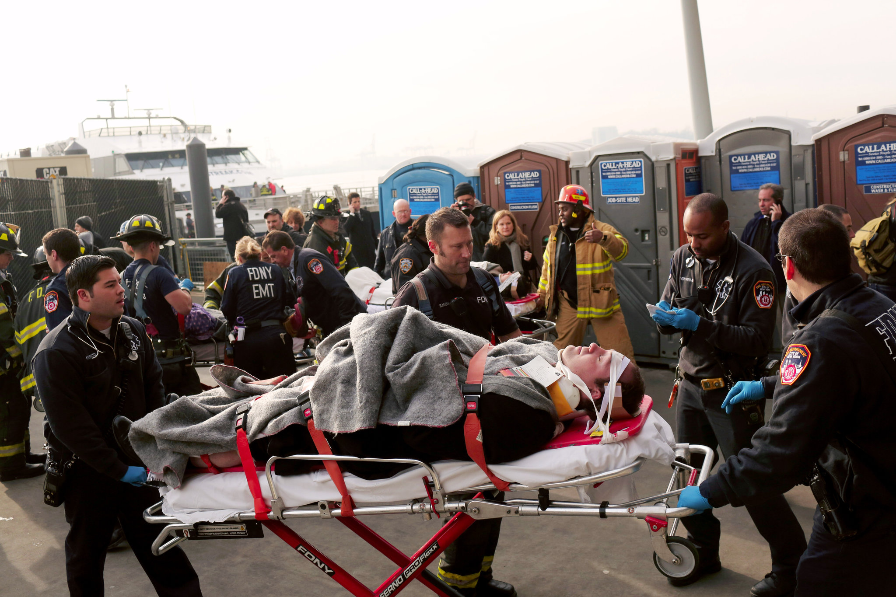
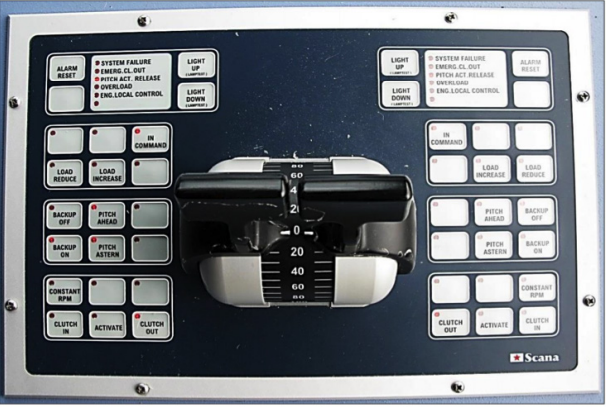

# Insiden Kapal Ferry New York 2013
Pada pagi hari tanggal 9 Januari 2013, 300 orang menaiki kapal Ferry yang menyeberangi sungai dari Seastreek ke Wall Street. Saat kapal ingin bersandar, bukannya memperlambat kapal malah menaikkan kecepatannya dan menabrak dermaga dengan kecepatan 12 knots atau setara dengan 14 mph. Kejadian ini menyebabkan sekitar 79 orang terluka di mana 75 orang terluka ringan sementara 4 lainnya terluka parah. 
Link berita: (https://edition.cnn.com/2013/01/09/us/new-york-ferry-accident/index.html)

## Penyebab
Kejadian ini disebabkan oleh kelalaian kapten kapal saat ingin berlabuh di dermaga. Sebelum berlabuh, kapten kapal merasakan getaran pada kapalnya dan mengira ada sesuatu yang menyangkut di baling=baling kapal. Kapten kapal lalu mengganti mode kendali menjadi *backup mode* di mana dia bisa mengontrol baling-baling secara manual. Nahas, ketika ingin berlabuh kapten kapal lupa mengganti mode kendali ke mode normal sehingga manuver yang dilakukan kapten kapal bukannya memperlambat malah mempercepat laju kapal. Kapten kapal dikenal sebagai kapten yang mahir dan berpengalaman. Dia bahkan menjadi trainer bagi kapten lain tentang *piloting system* ini.

## Design Error

Design tombol dari controller terlalu kecil dan indikatornya hanya titik merah kecil yang menyala jika mode on. Hal ini menyulitkan kapten untuk menyadari dia sedang di mode yang mana dan tombol susah dicari karena ukuran sama dan cara penggunaannya sama.

## Improvement
- Seharusnya visual status dibuat lebih mudah dilihat agar user bisa dengan mudah mengetahui sedang berada di mode yang mana
- Perbedaan bentuk dan ukuran tombol agar tidak terjadi kesalahan saat memencet tombol yang disebabkan oleh ketidaksengajaan.

## UX Mockup Revised

