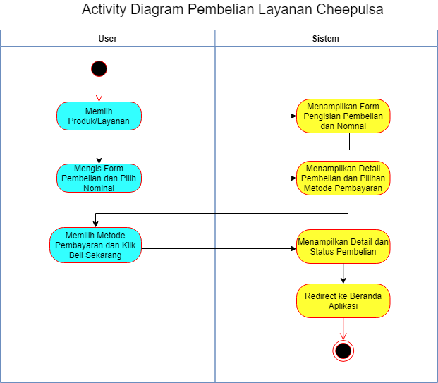

# Give reasoning why it isn’t pleasant or cumbersome to use
- Terlalu flat dan kaku
- Terdapat banyak space kosong
- Gambar ikon monoton satu warna

# Pointed out the flaw in interaction control
- Warna gradien pada login yang mengganggu penglihatan user saat mengisi form username dan password
- Tidak ada logo/gambar produk pada pilihan saat ingin memilih produk apa yang ingin dibeli sehingga cukup menyulitkan user harus membaca dengan benar nama produknya
- Tidak ada placeholder pada form pengisian nominal dan nomor hp sehingga user tidak tahu format apa yang digunakan sehingga rawan terjadi kesalahan

# Identify Key Business Use Case
Dari semua use case yang ada di Cheepulsa, menurut kami key business use case nya adalah Pembelian Layanan karena core dan tujuan dari aplikasi ini adalah pembelian layanan oleh user. Mengapa deposit saldo tidak kami pilih juga sebagai key use case karena saat pembayaran, user dapat memilh metode pembayaran selain saldo sehingga deposit saldo tidak diperlukan apabila user ingin melakukan pembelian. 

## Activity Diagram Key Business Process

