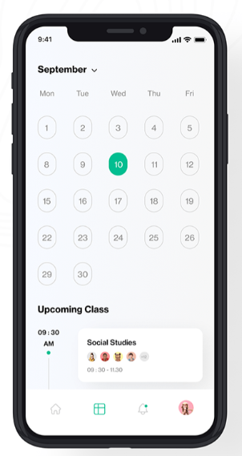
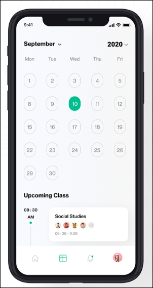

# Wawancara bersama Mas Iza
## Narasumber kami bernama Farriza Ahmad Abdillah. Beliau merupakan seorang UI/UX Designer di OXXO Digital Agency

**Sudah berapa lama berkecimpung di dunia UI/UX design?**
>Sekitar 1 tahun

**Kalau dihitung berdasarkan project aplikasi, sudah berapa banyak yang mas buat design UI/UX nya?**
>Kalau yang di OXXO ini kan kebetulan agency jadi kira-kira sudah ada 15 yang sudah pernah dibuat. Kalau sebelum di OXXO lebih ke product development jadi membuat suatu product yang memang kebutuhan dari company tersebut. Totalnya kira-kira sekitar 15-17 project

**Menurut mas Iza, ketika mendesain sesuatu apakah ada filosofi-filosofi desain yang mas Iza ikuti?**
>Paling lebih ke tren sih. Gimana tren design yang lagi hits di tahun ini misalnya. Tapi tergantung dari kebutuhan clientnya juga. Data apa aja yang mereka kasih, kira-kira cocok ga mengikuti tren yang ini? Soalnya ada kan perspektif orang lain beda-beda. Ada yang pengen designnya bagus tapi ngasih kontennya kurang. Jadi tinggal gimana kitanya aja sih implementasi data yang dikasih ke dalam suatu design. Karena kalo di agency kita harus ngikutin yang client suka jadi misal udah design bagaimanapun kita tetep harus ngikutin mau client.

**Apakah boleh melihat portofolio mas Iza?**
>Ya, boleh ini [portfolio](https://dribbble.com/Izaiza) saya. Kalau saran dari saya ketika membuat portfolio jangan designnya saja. Sertakan data-data pendukung untuk user experiencenya soalnya pas interview biasanya ditanya.

**Ada kebiasaan atau cara tertentu tidak Mas untuk mempertimbangkan user experience nya? Kalau ada, boleh dikasih contoh kasusnya, Mas?** 
>Kalau contoh kasus, Facebook kan kalo yang mobile di atas ya menu-menunya. Agak susah dijangkau oleh jari kan tuh kadang. Secara UX kan jari harus ada usaha untuk ke atas. Jadi kalau bisa ya navbarnya di bawah. Sebisa mungkin buat supaya user udah menggunakan product kita. Kalau bisa bikin hanya 1 step kenapa bikin 2 step kan mubazir. Jadi intinya harus mudah sih kalo UX. 

**Menurut mas Iza, bad design itu seperti apa?**
>Kalau UX nya tidak bagus. Coba lihat satisfied.user di Instagram. Nah di sini diberitahu kalau good UX itu harus gimana. Nih seperti ada design di dribble yang likesnya lebih dari seribu tapi bukan UX yang bagus karena navbar nya di samping dan menimbulkan masalah yang tadi tentang touch area. Teksnya juga terlalu kecil.

**Berarti tidak selamanya yang UInya bagus itu UXnya bagus juga ya mas?**
>Betul, kalau di dribble juga dia lebih mengutamakan visualnya dulu mungkin.

**Kalau disuruh memilih, mana yang lebih penting antara UI atau UX?**
>Dua-duanya penting sih. Tapi kalau di agency ada briefing dan wireframe dulu dengan client. Jadi kalo client suka baru nanti lanjut ke tahap design. Proses lamanya di wireframe sih. 

**Apakah mas Iza memiliki seseorang yang menjadi inspirasi atau tolak ukur yang sama-sama berkecimpung di dunia UI/UX Design ini?**
>Ya, ada. Kalau design sih lebih ke Cuberto. Ini simple sih cuma kadang UXnya kurang bagus. Tapi secara UI kebanyakan bagus ini

**Menurut mas Iza, apa sih tolak ukur dari berhasilnya sebuah UI/UX design?**
>Berhasil tuh saat productnya launch sih

**Kalau sudah launch terus ada keluhan gimana mas?**
>Nah kan ada namanya testing. Sebelum launching ditest dulu dan namanya keluhan pasti ada. Cuma kan ada beberapa tipe user ya, ada yang ga paham banget, ada yang paham tapi males ngotak-ngatik. Kalau ada user yang ga paham banget ya kita harus sabar aja sih. Meskipun kita sudah bikin UXnya semudah mungkin tapi kalau usernya kurang update ya gimana. Lebih harus mengedukasi sih.

**Menurut mas, UX tren saat ini bisa dipakai ga sih di Indonesia? Sudah pantas belum sih untuk masyarakat Indonesia? Kalau dilihat contoh kayak M-Banking BCA kan iconnya besar-besar, itu gimana Mas?**
>Justru itu sangat bagus sih. Karena target usernya kan usia 30 ke atas. Kalau user seperti itu pakai Jenius mungkin akan bingung. Kembali lagi ke targetnya sih goalsnya.

**Tapi kalau menurut Mas, UI/UX Designer harus bisa coding ga mas?**
>Nggak. Asal bisa paham alurnya, flow aplikasi productnya

**Pernah diprotes sama programmernya ga mas?**
>Wah, sering. Yang UI kayak Cuberto itu kalau di Indonesia agak susah tuh. Karena implementasinya susah tapi bagus. 

**Diskusi ke programmernya pas tahap apa mas?**
>Pas udah selesai design, programmer lihat dulu kira-kira mana yang susah diimplementasi. Nanti diskusi sama PM juga gimana kira-kira yang enak buat programmer, buat designer, buat clientnya juga. Yang penting kan goals clientnya tercapai.

**Pernah ga ada client yang minta designnya gini, tapi menurut mas Iza ga bagus itu nanti disaranin atau gimana mas?**
>Ya, kasih saran bisa. Cuma kalo clientnya keras kepala, yaudah. Biasanya yang bagus itu design pertama, kedua, ketiga abis itu kasarnya yaudah ngikutin aja. Kalo di agency gitu sih. Tapi kalo kerja di agency itu paling bagus pengalamannya karena sudah terbiasa kerja cepat dan deadline yang numpuk. Kalo pas masuk Agency sih biasanya langsung dikasih 4-5 lah kira kira. Tapi jangan lama-lama capek soalnya di agency. Yang ini belum beres ada lagi yang baru. 

**Biasanya kalo ngerjain itu metodenya gimana mas? Kayak waterfall atau ada targetan per minggu?**
>Targetan per minggu sih. Tahap awal kan biasanya ikut meeting tuh UI/UX sama PM. UI/UX ngesketch user flow nya terus lanjut ke wireframe client bisa ngasih komentar. 

## Link Wawancara
[Link Youtube Interview UI/UX Designer, Mas Farriza Ahmad](https://youtu.be/E0EcdpvGL2s)

## Improvement
Kami mengambil project Mas Iza yang berjudul [Classku](https://dribbble.com/shots/14260560-Classku-Mobile-Design-Concept)\ Hal yang ingin kami tingkatkan adalah pada bagian jadwal kelas 

**Before**\
\
Karena pada design tersebut seharusnya bisa ditingkatkan agar dari segi user pun lebih mudah dalam mengetahui jadwal. Karena pada design sebelumnya tidak dicantumkan tahun.

**After**\
