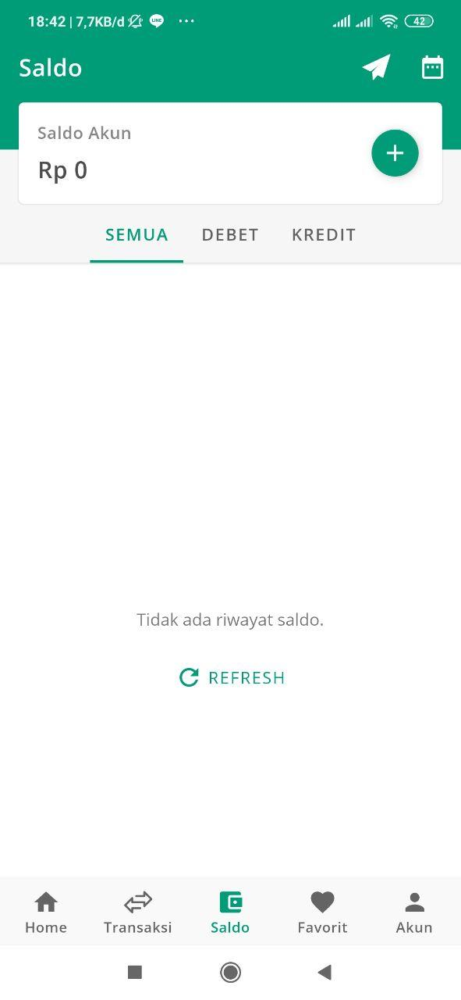

# Day 1 Report (6 Oktober 2020)
[IMK Team A - First Day Report](https://www.youtube.com/watch?v=eY5T0DOOjfw)

# Day 2 Report (12 Oktober 2020)
Design Sebelumnya:

Design Improve Gian

File figma dapat di lihat di [sini](ImproveGian)

# Day 3 Report (14 Oktober 2020)

# Day 4 Report

# Business process expansion to achieve better experience key features
Pada pembelian layanan, ada baiknya untuk menyediakan e-wallet lain yang banyak digunakan oleh masyarakat namun belum ada di pilihan seperti DANA dan Gopay agar user memiliki banyak pilihan metode pembayaran sehingga memudahkan user dalam bertransaksi di Cheepulsa. 

# Tool yang digunakan
Figma
