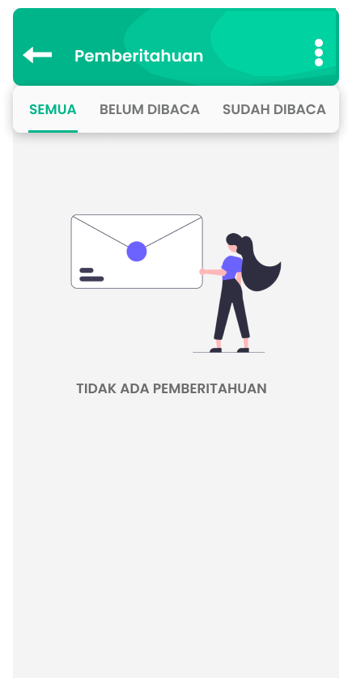

# Day 1 Report (6 Oktober 2020)
[IMK Team A - First Day Report](https://www.youtube.com/watch?v=eY5T0DOOjfw)

# Day 2 Report (12 Oktober 2020)
## Design Sebelumnya:
\

## Design Improve Gian:
\

\
\
**File figma dapat di lihat di [sini](ImproveGian)**

## Design Improve Lazuardy(Selected):
\

\
\
**File figma dapat di lihat di [sini](ImproveLazu)**

# Day 3 Report (14 Oktober 2020)

# Day 4 Report (14 Oktober 2020)

# Business process expansion to achieve better experience key features
Pada pembelian layanan, ada baiknya untuk menyediakan e-wallet lain yang banyak digunakan oleh masyarakat namun belum ada di pilihan seperti DANA dan Gopay agar user memiliki banyak pilihan metode pembayaran sehingga memudahkan user dalam bertransaksi di Cheepulsa. 

# Explanation of which material design philosophy per components
1. Card \
Di setiap komponen card, kami menambahkan bayangan.
Ini merupakan penerapan dari prinsip material yang terinsipirasi dari fisik dunia dan teksturnya, dimana card ini menghasilkan bayangan.

2. Button \
Di setiap button, bentuknya tetap sama dan tidak beda jauh.
Ini merupakan penerapan dari prinsip material mengenai One Adaptive Design, yaitu semua desain dibangun dari satu tunggal desain yang adaptif.

3. Typography \
Di setiap tulisan, kami memakai font yang cukup tebal.
Ini merupakan penerapan dari prinsip material yang kontennya dicetak tebal.

4. Input \
Di setiap input, user bisa mengubahnya secara langsung.
Ini merupakan penerapan dari prinsip material yang mengedepankan tindakan pengguna.

# Subtitle File
[Day 1](day1sub.txt)
\
[Day 3](day3sub.txt)
\
[Day 4](day4sub.txt)

# Tool yang digunakan
Figma
